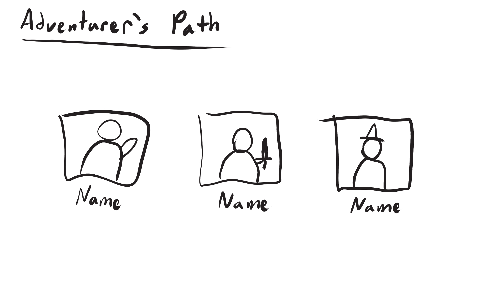

# Adventurer Journey - Front End
The candidate should have a branch created for them. They will then submit their completed code back to the branch for Yahara Softare to review.

They will follow the setup instructions and story instructions below to create a User interface for an adventurers journey around a map. This should take no longer than a few hours. It is not intended to perseverate over the problem but to create a common talking point.

*Remember - This is a basic React application setup with Parcel.js. Please use whatever references and tooling you would like to complete the story.*

## Setup Instructions
- App Setup - [./docs/App Setup.md](./docs/resources/App%20Setup.md)
- Run Application - [./docs/Run Application.md](./docs/resources/Run%20Application.md)

## Story Instructions
Create a User Interface to track an adventurers journey through an undiscovered area. The goal is to create an interface where you can choose and adventurer and show their path around the map. 

Using the provided wireframe create a user interface to display an adventurers journey across the map. **Take as much creative liscense** in the design as you wish. At the minimum it should be functional, display relevant information, and be easy to use.

There are 2 main views:

### 1) Select an Adventurer
Create a button for each of the adventurers in the example below. Clicking this will select the adventurer whos path you will display in the next view.

Example Adventurer Paths & Instructions - [./docs/resources/Example Adventurer Paths.md](./docs/resources/Example%20Adventurer%20Paths.md)

### 2) Display a previous Adventurers path on the map
You will create a button that calls a function to “fake” an api return of a previous adventurers instructions. This will return one of the `Example Adventurer Paths` linked above in the first view. Using the instructions, display on the map the pathway the adventurer took, including starting and ending points.

Create a button and functionality to clear the map back to a fresh state. Additionally, create a button to return the first view to select a different adventurer.

**Tech Notes:**
- Use any resources or tools you would like.
- Fake api calls do not actually need to interact with Fetch or an api. They are just functions to fake return and save functionality.
- Adventurer will start in the middle of the map
- The map must be big enough to display the entire route without looping to the other side.